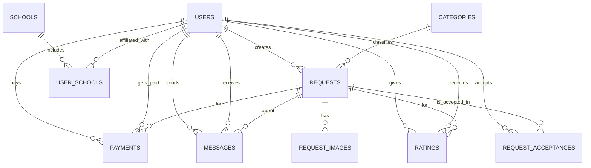

```mermaid
erDiagram
    USERS ||--o{ REQUESTS : creates
    CATEGORIES ||--o{ REQUESTS : classifies
    REQUESTS ||--o{ REQUEST_IMAGES : has

    USERS ||--o{ REQUEST_ACCEPTANCES : accepts
    REQUESTS ||--o{ REQUEST_ACCEPTANCES : is_accepted_in

    USERS ||--o{ RATINGS : gives
    USERS ||--o{ RATINGS : receives
    REQUESTS ||--o{ RATINGS : for

    SCHOOLS ||--o{ USER_SCHOOLS : includes
    USERS ||--o{ USER_SCHOOLS : affiliated_with

    USERS ||--o{ MESSAGES : sends
    USERS ||--o{ MESSAGES : receives
    REQUESTS ||--o{ MESSAGES : about

    USERS ||--o{ PAYMENTS : pays
    USERS ||--o{ PAYMENTS : gets_paid
    REQUESTS ||--o{ PAYMENTS : for
```
